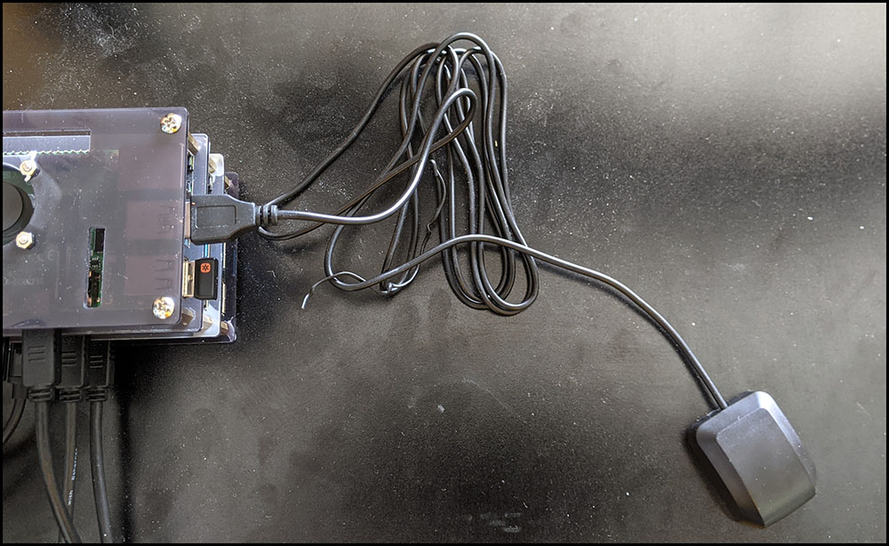

# `simplegps`

[UNDER CONSTRUCTION]

* [Purpose](#purpose)
* [Preparing the hardware](#preparing-the-hardware)
    * [Attaching the GPS dongle](#attaching-the-GPS-dongle)
    * [Identify the device](#identify-the-device)
* [Installing GPSD](#installing-gpsd)
* [Getting `simplegps` Up and Running](#getting-simplegps-up-and-running)
   * [Cloning the source code from GitHub](#cloning-the-source-code-from-github)
   * [Installing the Node.js dependencies](#installing-the-nodejs-dependencies)
   * [Starting the application](#starting-the-application)
* [Monitoring GPS behavior](#monitoring-gps-behavior)


## Purpose:

The purpose of this project is to demonstate how to consume geolocation information captured by a GPS device connected to a Raspberry Pi and then publish the event information to a message broker such as Redis or Kafaka.

This project is intended to run on a Linux system. The project requires that the [GPSD](https://www.linux-magazine.com/Issues/2018/210/Tutorial-gpsd) daemon is installed and running on the host machine.

## Preparing the hardware

In order to use this microservice you are going to have have a Linux computer with a GPS Dongle attached directly to the machine. The code was developed using a [Onyehn VK-162 G-Mouse USB GPS Dongle](https://www.amazon.com/gp/product/B07GJGSZB9/). It's an inexpensive piece of equipment that costs less than $15 USD.

### Attaching the GPS dongle

You'll plug the GPS Dongle into a USB port of your Linux computer or Raspberry Pi as shown in the figure below:



### Identify the device 

The device file for GPS Dongle needs to be identified. Typically it's in the `/dev` directory of the host computer. One way make the identification is to get a listing of files in the `/dev` diretory before the Dongle is installed.

When I first added the Dongle to my machine it appeared with a filename prefix of `ttyACM`. Thus, **before** I attached the Dongle, I listed the files in the `/dev` folder filtering on the prefix, `ttyACM` like so:

`$ ls /dev | grep ttyACM`

**WHERE** `$` is a command line prompt. Don't use it when you enter the command.

I got the result:

`ttyACM0`

Then I inserted the GPS Dongle into a USB port and took another look at the `/dev` directory, like so, again:

`$ ls /dev | grep ttyACM`

I got the result:

```
ttyACM0
ttyACM1
```

Thus, I inferred that the device file for the GPS Dongle is `/dev/ttyACM1`.

Save this piece of information. You might need it later, if you have trouble reading data off of the GPS Dongle and need to do some troubleshooting or declare configuration settings for the `GPSD` daemon that you'll install next.

## Installing GPSD

[GPSD](https://gpsd.gitlab.io/gpsd/) in a Linux daemon that will bind your GPS Dongle to the operating system and then read data coming off the Dongle from satellites circling the planet. Take a minute to think about this: for less than $15 USD you can buy a piece of equipment that will download data from not one, but many satellites circling the globe. And the [US Space Command](https://www.spacecom.mil/#/) provides GPS for free, as in nothing, zip! 

But, I digress.

To install GPD execute the following commands:

Update `apt`:

`sudo apt update`

Then install GPSD:

`sudo apt install GPSD`

Use `systemctl` to make it so `gpsd` starts on bootup:

`sudo systemctl enable gpsd`

Start up `gpsd` and `gpsd.socket`
:
`sudo systemctl start gpsd`

`sudo systemctl start gpsd.socket`

You can verify that GPSD is running by using the `cgps` utlity that  ships with the download.

`cgps`

You'll get output that looks similar to the following:

```
┌───────────────────────────────────────────┐┌──────────────────Seen 13/Used  5┐
│ Time:          2021-05-26T00:27:33.000Z   ││     PRN  Elev   Azim   SNR  Use │
│ Latitude:         34.02028133 N           ││GP     5  25.0   44.0  20.0   Y  │
│ Longitude:       118.41134850 W           ││GP    13  25.0   74.0  14.0   Y  │
│ Alt (HAE, MSL):    -72.507,     35.433 ft ││GP    18  57.0  323.0  17.0   Y  │
│ Speed:             1.59 mph               ││GP    25  15.0  188.0  13.0   Y  │
│ Track (true, var):                n/a deg ││GP    26  28.0  289.0  17.0   Y  │
│ Climb:           -39.37 ft/min            ││GP    10  21.0  225.0  20.0   N  │
│ Status:         3D FIX (6 secs)           ││GP    15  42.0  110.0   0.0   N  │
│ Long Err  (XDOP, EPX):  0.83, +/- 37.2 ft ││GP    16  17.0  314.0  16.0   N  │
│ Lat Err   (YDOP, EPY):  1.09, +/- 52.4 ft ││GP    20  46.0   44.0   8.0   N  │
│ Alt Err   (VDOP, EPV):  3.28, +/-  212 ft ││GP    23  54.0  228.0   0.0   N  │
│ 2D Err    (HDOP, CEP):  1.37, +/- 81.7 ft ││GP    29  70.0  114.0   0.0   N  │
│ 3D Err    (PDOP, SEP):  3.55, +/-  193 ft ││SB    46  49.0  199.0   0.0   N  │
│ Time Err  (TDOP):       1.56              ││SB    51  49.0  161.0   0.0   N  │
│ Geo Err   (GDOP):       3.86              ││                                 │
│ ECEF X, VX:              n/a    n/a       ││                                 │
│ ECEF Y, VY:              n/a    n/a       ││                                 │
│ ECEF Z, VZ:              n/a    n/a       ││                                 │
│ Speed Err (EPS):       +/- 71.4 mph       ││                                 │
│ Track Err (EPD):        n/a               ││                                 │
│ Time offset:           0.057 sec          ││                                 │
│ Grid Square:            DM04ta            ││                                 │
└───────────────────────────────────────────┘└─────────────────────────────────┘
```
`cgps` is a useful utilty **but be advised**, it takes a minute of two to "warm up' in order to receive and display gps data. If for some reason you are not seeing data in the dashboard or not seeing raw gps data being outputted below the dashboard, you've got a problem with your GPSD installation. You'll need to do some troubleshooting. 

## Getting `simplegps` Up and Running

Assuming the the GPS dongle is attached and operational, execute the following steps to get `simplegps` up and running. When the installation is complete you'll be able to see data associated with format type, `GPGGA`, coming in from the attached GPS device in the log file at `./logs/app.log`. Also, the incoming all the raw GPS data will be shown as `stdout` in the terminal window or development console.

### Cloning the source code from GitHub

Execute the following command:

`git clone https://github.com/reselbob/simplegps.git`

### Installing the Node.js dependencies

Navigate to the working directory for `simplegps`

`cd simplgps`

Execute the following command:

`npm install`

### Starting the application

`node index.js`

## Getting the current location

The `simplegps` microservice exposes an endpoint that returns the current location of the GPS Dongle. To find the current location of the GPS Dongle, execute the following command:

`curl http://localhost:3000/currentLocation`

You'll get output similar to the following:

```
{
  "messageTypeId": "$GPGGA",
  "utcTime": "054707",
  "latitude": "3401.2074",
  "latHemisphere": "N",
  "longitude": "11824.6769",
  "longHemispere": "W",
  "positionFixIndicator": "1",
  "satelliteNumber": "06",
  "HDOP": "1.90",
  "altitude": "30.58",
  "altitudeUnits": "M",
  "heightAboveWGS84Ellipsoid": "-32.003",
  "heightAboveWGS84EllipsoidUnits": "M",
  "timeSinceLastUpdate": "",
  "checkSum": "*49"
}

```

## Monitoring GPS behavior

## Fast Troubleshooting

Sometimes you might have to expicitly configure GPSD to read the correct device. 

I had to do this once or twice. In my case, I had to tell GPSD exactly which device to use, which on my machine was at `/dev/ttyACM1`.

First, I had to stop GPSD dead in its tracks. To do this I exected the following command:

`sudo killall gpsd`

Then, I updated the file `/etc/default/gpsd` to the following. 

```
# Default settings for the gpsd init script and the hotplug wrapper.

# Start the gpsd daemon automatically at boot time
START_DAEMON="true"

# Use USB hotplugging to add new USB devices automatically to the daemon
USBAUTO="true"

# Devices gpsd should collect to at boot time.
# They need to be read/writeable, either by user gpsd or the group dialout.
DEVICES="/dev/ttyACM1"

# Other options you want to pass to gpsd
GPSD_OPTIONS="-n -G -b"
GPSD_SOCKET="/var/run/gpsd.sock"
#end of file gpsd

```

I changed the line to the one shown at `DEVICES="/dev/ttyACM1"`. Also, a set `USBAUTO` to `true` as follows:

`USBAUTO="true"`

Finally, I restarted `gpsd` like so:

```
sudo systemctl start gpsd
sudo systemctl start gpsd.socket
```


